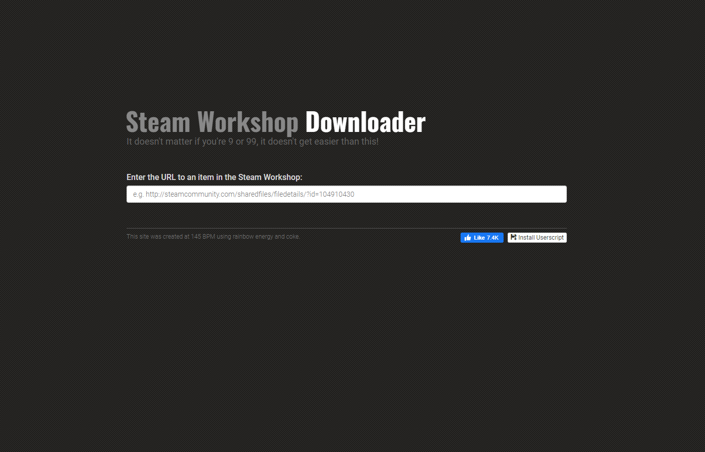

**This project was archived and shutdown in April 2020 due to most games having moved away from the IRemoteStorage API that this project utilized.**

# Steam Workshop Downloader

This simple website utilizes the Steam Workshop API to allow users to download
content directly, instead of having to rely in in-game downloads. This could be
useful for a variety of reasons, such as if one wants to manually tinker with
the content in question.

It was originally created during a short sprint back in the summer of 2014, and
is the spiritual successor to *Gaddons*.

